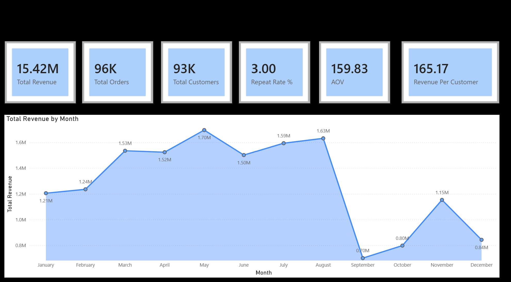
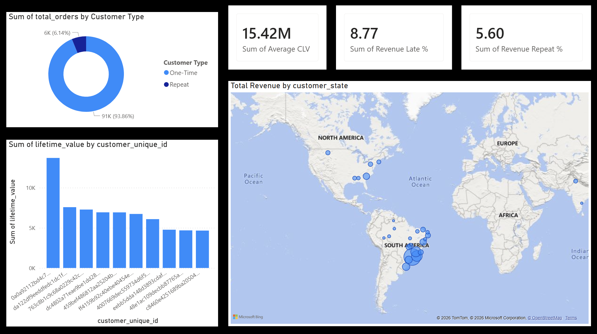

# 🚀 AI-Powered E-Commerce Executive Analytics Platform  
### MySQL + Power BI + Gemini AI

---

## 📌 Project Overview

This project delivers a complete end-to-end analytics solution on the Brazilian Olist e-commerce dataset.

It combines:

- Advanced SQL analytics (MySQL 8.0)
- AI-generated executive board reporting (Gemini 2.5 Flash-Lite)
- Interactive executive dashboard (Power BI)
- Revenue concentration & RFM analysis
- Operational performance diagnostics
- Query optimization & indexing

The objective was not just to analyze data —  
but to simulate real-world responsibilities of a remote data analyst and analytics engineer.

This project moves beyond descriptive SQL and demonstrates business interpretation, performance optimization, and AI-driven executive storytelling.

---

## 📊 Dashboard Preview

### Executive Overview – Page 1



### Strategic & Operational Analysis – Page 2



---

## 🏗 Architecture

```
Raw Olist Dataset
        ↓
MySQL Relational Schema
        ↓
Analytical Views (vw_order_enriched, vw_customer_lifetime)
        ↓
Python AI Layer (Gemini 2.5)
        ↓
Executive Text Report (.txt)
        ↓
Power BI Executive Dashboard (.pbix)
```

---

## 📂 Repository Structure

```
ecommerce-advanced-analytics/
│
├── powerbi/
│   └── Olist E-Commerce Executive Analytics Dashboard.pbix
│
├── sql/
│   └── ecommerce_analytics.sql
│
├── generated_report/
│   └── sample_executive_report.txt
│
├── screenshots/
│   └── (dashboard previews)
│
├── ai_analyst.py
├── README.md
├── .env.template
└── requirements.txt
```

---

## 🗄 Dataset

Source: Olist Brazilian E-Commerce Dataset (Kaggle)

Time Period Covered:  
September 2016 – August 2018

Entities included:

- Customers
- Orders
- Order Items
- Payments
- Reviews
- Products
- Sellers
- Geolocation
- Category Translation

---

## 🛠 Tools & Technologies

- MySQL 8.0
- MySQL Workbench
- Window Functions
- Common Table Expressions (CTEs)
- Views & Index Optimization
- Execution Plan Analysis (EXPLAIN)
- Python
- Google Gemini 2.5 Flash-Lite
- Power BI (DAX + Data Modeling)

---

## 🧱 Database Design & Optimization

The schema includes:

- Proper primary and foreign key constraints
- Order-level aggregation view (vw_order_enriched)
- Customer lifetime aggregation view (vw_customer_lifetime)
- Optimized join-heavy queries with indexes

### Indexes Added

- orders(order_purchase_timestamp)
- orders(customer_id)
- order_items(order_id)
- order_items(product_id)
- order_reviews(order_id)

Execution plans were validated using EXPLAIN to confirm index usage and reduce full table scans.

---

## 🧹 Data Cleaning & Validation

- NULL value validation (dates, price, freight)
- Datetime normalization using STR_TO_DATE (millisecond handling)
- Duplicate review detection
- Price & freight range validation
- DISTINCT-based order-level aggregation to prevent row inflation
- Delivery NULL filtering for accurate operational metrics

---

## 📊 Core Business KPIs

### Revenue & Growth

- Total Revenue (Gross Merchandise Value)
- Monthly Revenue Trend
- Month-over-Month Growth %
- Monthly Order Volume
- Average Order Value
- Revenue Per Customer

Insight:  
Revenue growth is primarily driven by new customer acquisition rather than repeat purchasing behavior.

---

### Customer Analytics

- Repeat Purchase Rate (~3%)
- Customer Lifetime Value (CLV)
- Revenue Contribution of Top 10% Customers (~37%)
- Customer Acquisition Trend
- RFM Base Segmentation (Recency, Frequency, Monetary)

Insight:  
Revenue is highly concentrated among top customers, while retention remains structurally weak.

---

### Operational Performance

- Late Delivery Rate (~8%)
- Late vs On-Time Review Impact (4.29 → 2.57 rating drop)
- Average Delivery Days
- Order Funnel (Purchase → Approved → Shipped → Delivered → Canceled)
- Cancellation Rate by Category

Insight:  
Delivery delays significantly reduce customer satisfaction and present operational risk.

---

### Product & Seller Intelligence

- Top Revenue Categories
- Category Rating vs Revenue Comparison
- Top Sellers by Revenue
- Sellers with Low Ratings
- Heavy vs Light Product Delivery Impact

Insight:  
High-revenue categories maintain strong ratings, indicating product-market alignment, but operational improvements are needed for sustainable growth.

---

## 🤖 AI Executive Reporting Layer

The project integrates Gemini 2.5 Flash-Lite to transform raw SQL metrics into a structured board-level memorandum.

The Python layer:

- Connects to MySQL
- Extracts advanced KPIs
- Converts decimals safely
- Generates structured executive report
- Outputs clean board-ready text file

This simulates real-world AI-augmented analytics workflows.

---

## 📈 Power BI Executive Dashboard

The Power BI dashboard includes:

Page 1 – Executive Overview  
- Total Revenue  
- Total Orders  
- Total Customers  
- Repeat Rate %  
- AOV  
- Revenue Per Customer  
- Monthly Revenue Trend  

Page 2 – Strategic Diagnostics  
- Customer Type Distribution  
- Revenue Concentration  
- Delivery Impact  
- Operational Performance Indicators  

The dashboard follows clean executive design principles:
- White background
- Consistent blue accent
- Minimal clutter
- KPI-focused layout

---

## 🔍 Advanced SQL Techniques Used

- CTE chaining
- Window functions (ROW_NUMBER, NTILE, LAG)
- Revenue concentration modeling
- Cohort-style customer grouping
- RFM base modeling
- Order-level distinct aggregations
- Index performance optimization
- View-based analytical layer

---

## 📌 Key Strategic Insights

- Repeat purchase rate is approximately 3%, indicating retention weakness.
- Top 10% customers contribute ~37% of revenue, creating revenue concentration risk.
- Late deliveries (~8%) significantly reduce review scores.
- Revenue peaked during strong acquisition cycles but lacks repeat reinforcement.
- Operational improvements in delivery can directly improve retention metrics.

---

## 🔐 Environment Variables

Copy `.env.template` and create `.env`.

Required variables:

- DB_HOST
- DB_USER
- DB_PASSWORD
- DB_NAME
- GEMINI_API_KEY

Environment variables are excluded from version control.

---

## 🚀 Project Objective

This project demonstrates the ability to:

- Design relational database systems
- Write production-grade SQL
- Optimize query performance
- Translate data into business strategy
- Integrate AI into analytics workflows
- Build executive-ready dashboards
- Think from both analytical and operational perspectives

This simulates real-world responsibilities of a remote data analyst / analytics engineer.

---

## 🔮 Future Enhancements

- Full RFM quintile segmentation with labeled customer tiers
- Cohort retention matrix
- Predictive churn modeling
- Revenue forecasting
- Automated dashboard refresh pipeline
- Deployment-ready architecture

---

## 👤 Author

Swapitsneil  
Data Analytics | SQL | Power BI | AI-Augmented Business Intelligence

---

If this project was useful or interesting, feel free to ⭐ the repository.
